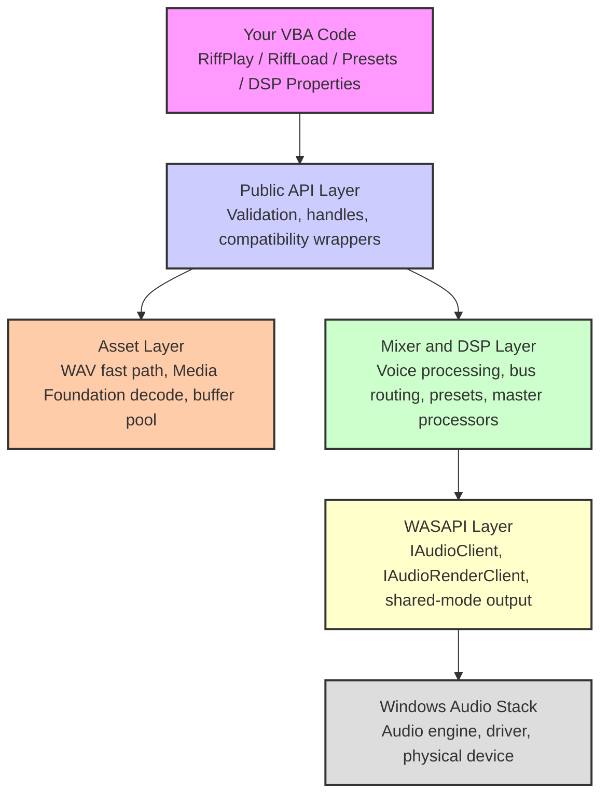
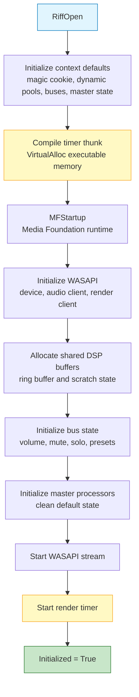
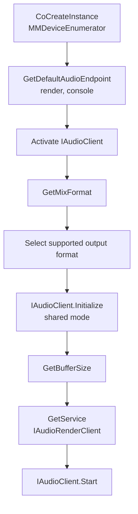
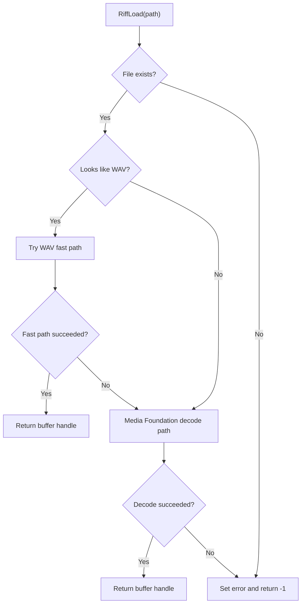
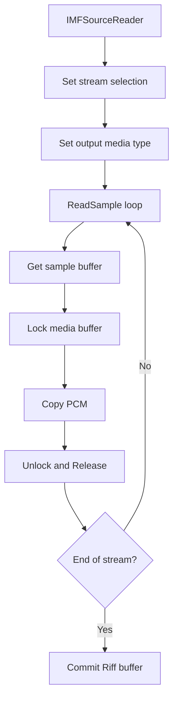
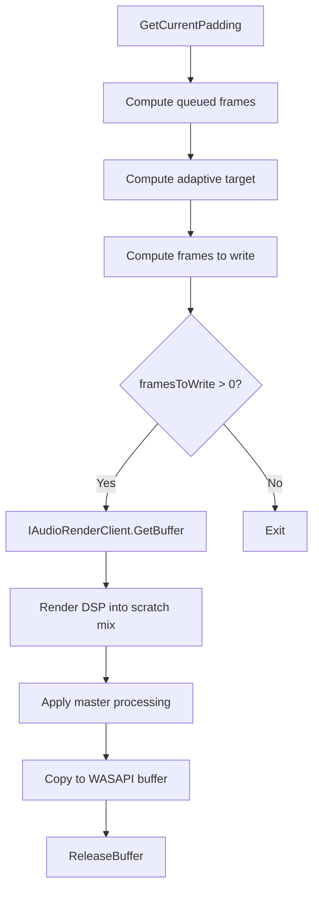
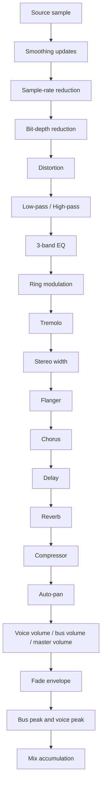
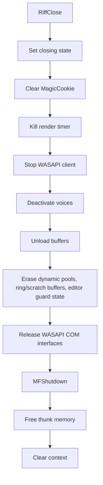

# Riff Architecture

Riff is a single-file VBA audio engine for Windows Office hosts. It combines Media Foundation decoding, WASAPI shared-mode output, a native timer thunk, a real-time DSP mixer, per-voice effects, persistent bus presets, optional master bus processing, dynamically growing audio pools, and editor-safe development guards while remaining contained inside one `.bas` module.

## Table of Contents

- [High-Level Overview](#high-level-overview)
- [Design Goals](#design-goals)
- [Runtime Model](#runtime-model)
- [Global State](#global-state)
  - [RiffContext](#riffcontext)
  - [RiffBuffer Pool](#riffbuffer-pool)
  - [RiffVoice Pool](#riffvoice-pool)
  - [RiffBus State](#riffbus-state)
  - [Dynamic Pool Growth](#dynamic-pool-growth)
  - [Capacity Reservation](#capacity-reservation)
  - [Master Processor State](#master-processor-state)
  - [Ring Buffer](#ring-buffer)
- [Initialization Sequence](#initialization-sequence)
  - [Thunk Compilation](#thunk-compilation)
  - [WASAPI Initialization](#wasapi-initialization)
  - [Media Foundation Startup](#media-foundation-startup)
  - [Default Mixer State](#default-mixer-state)
- [Audio Loading Pipeline](#audio-loading-pipeline)
  - [RiffLoad Dispatch](#riffload-dispatch)
  - [WAV Fast Path](#wav-fast-path)
  - [Media Foundation Decode Path](#media-foundation-decode-path)
  - [Memory-Based Loading](#memory-based-loading)
  - [Decode Hot Path Optimization](#decode-hot-path-optimization)
- [Playback Allocation](#playback-allocation)
  - [Unified Playback Entry Point](#unified-playback-entry-point)
  - [Voice Allocation](#voice-allocation)
  - [Pool Growth During Playback](#pool-growth-during-playback)
  - [Voice Stealing](#voice-stealing)
  - [Burst Caps](#burst-caps)
  - [RiffPlayOnce](#riffplayonce)
- [DSP Timer Callback](#dsp-timer-callback)
  - [Callback Guards](#callback-guards)
  - [Editor-Safe Development Mode](#editor-safe-development-mode)
  - [Adaptive Buffering](#adaptive-buffering)
  - [WASAPI Buffer Acquisition](#wasapi-buffer-acquisition)
  - [Voice Iteration](#voice-iteration)
  - [Source Reading and Pitch Shifting](#source-reading-and-pitch-shifting)
  - [Oscillator and Noise Generation](#oscillator-and-noise-generation)
- [Per-Voice DSP Pipeline](#per-voice-dsp-pipeline)
  - [Stage Order](#stage-order)
  - [Smoothing](#smoothing)
  - [Bitcrusher](#bitcrusher)
  - [Distortion](#distortion)
  - [Low-Pass and High-Pass Filters](#low-pass-and-high-pass-filters)
  - [3-Band EQ](#3-band-eq)
  - [Ring Modulator](#ring-modulator)
  - [Tremolo](#tremolo)
  - [Stereo Width](#stereo-width)
  - [Ring Buffer Effects](#ring-buffer-effects)
  - [Compressor](#compressor)
  - [Auto-Pan and Final Gain](#auto-pan-and-final-gain)
  - [Fade Envelope](#fade-envelope)
  - [Mix Accumulation](#mix-accumulation)
- [Bus Architecture](#bus-architecture)
  - [Bus Gain, Mute, and Solo](#bus-gain-mute-and-solo)
  - [Bus Fades](#bus-fades)
  - [Persistent Bus Presets](#persistent-bus-presets)
  - [Bus Peak Metering](#bus-peak-metering)
- [Preset Architecture](#preset-architecture)
  - [Voice Presets](#voice-presets)
  - [Musical Preset Packs](#musical-preset-packs)
  - [Bus Preset Application](#bus-preset-application)
- [Master Bus Processors](#master-bus-processors)
  - [Master Processor Stage](#master-processor-stage)
  - [Master Presets](#master-presets)
  - [Soft Clipping and Safety Limiting](#soft-clipping-and-safety-limiting)
- [Output Paths](#output-paths)
  - [32-Bit Float Path](#32-bit-float-path)
  - [32-Bit PCM Path](#32-bit-pcm-path)
  - [16-Bit PCM Path](#16-bit-pcm-path)
- [Peak Metering and Diagnostics](#peak-metering-and-diagnostics)
- [Loop, Seek, and Fade Systems](#loop-seek-and-fade-systems)
- [COM VTable Dispatch](#com-vtable-dispatch)
- [Platform Compatibility](#platform-compatibility)
- [Memory Layout](#memory-layout)
- [Shutdown Sequence](#shutdown-sequence)
- [Known Architectural Boundaries](#known-architectural-boundaries)

## High-Level Overview

Riff is a single-file VBA module (`Riff.bas`) that implements a complete real-time audio engine using native Windows APIs and COM interfaces. It carries no external dependency beyond components already available on modern Windows systems.

The engine is organized into six conceptual layers:



The public API remains small and handle-based. The user loads a buffer, starts a voice, routes it to a bus, and optionally applies presets or DSP parameters. Internally, Riff performs real-time mixing into the WASAPI render buffer. Current NEXT builds also treat buffers, voices, and bus storage as expandable `SafeArray` pools rather than small permanent limits, while preserving the same numeric handle style.

## Design Goals

Riff is built around a few strict goals:

| Goal | Architectural Choice |
|:---|:---|
| Single-file deployment | Everything lives inside `Riff.bas`. |
| No installer or registration | Uses Windows APIs directly, no ActiveX or external DLL requirement. |
| Office compatibility | Pure VBA API surface, x86/x64 declarations, safe cleanup paths. |
| Game-like audio | Polyphonic voices, buses, fades, looping, noise, oscillators, presets. |
| Practical performance | Native timer thunk, scratch buffers, direct memory copies, fast WAV path. |
| Safe host behavior | `EbMode` guard, `MagicCookie`, timer suspend/wake, explicit shutdown, manual editor-safe pause/resume. |
| Scalable projects | Dynamic `SafeArray` pools for buffers, voices, and buses instead of small hardcoded capacities. |
| Musical workflow | Preset packs, persistent bus effects, master processing, scene recipes. |

The engine is not a replacement for a native C/Rust audio thread. It is a highly optimized real-time audio system hosted inside Office/VBA.

## Runtime Model

The runtime model is handle-based:

```txt
Buffer handle = decoded audio asset in native memory
Voice handle  = active playback instance
Bus id        = routing group
Preset enum   = preconfigured DSP recipe
```

A buffer can be played by many voices. A voice can be routed to one bus. A bus can hold a persistent preset rule. The full mixed output can be processed by the master processor chain.

```txt
Buffer -> Voice DSP -> Bus gain/mute/solo -> Mix accumulation -> Master processors -> WASAPI
```

## Global State

Riff avoids object-heavy VBA abstractions. Almost all engine state lives in module-level UDTs and arrays.

### RiffContext

`RiffContext` is the main engine state object. It is stored as a single private module-level instance, usually named `rCtx`.

Typical categories inside the context:

| Category | Purpose |
|:---|:---|
| Guard | `MagicCookie`, `Initialized`, shutdown state |
| Device format | sample rate, block align, bits per sample, average bytes/sec |
| WASAPI pointers | device enumerator, device, audio client, render client, mix format |
| Timer | thunk pointer, timer id, auto-suspend state |
| Master | master volume, master peaks, soft clip, master processor state |
| Buses | dynamic bus states, initialized with the standard 16 built-in buses |
| Buffers | dynamic decoded buffer slots, initialized with 64 slots |
| Diagnostics | underruns, render errors, clipped samples, last padding/written frames |

The `MagicCookie` is a defensive guard. It is set during `RiffOpen` and cleared early in `RiffClose`. Timer callbacks check it before touching engine state.

### RiffBuffer Pool

Riff uses a dynamic pool of decoded audio buffers. Older builds used a fixed 64-slot pool; the NEXT 1.2.1 architecture keeps 64 as the initial capacity for compatibility, then grows the pool automatically when loading more assets.

Each slot stores:

| Field | Purpose |
|:---|:---|
| `Active` | slot contains valid decoded PCM |
| `BufferPtr` | pointer to `VirtualAlloc` memory |
| `BufferLen` | decoded PCM size in bytes |
| `FrameCount` / duration metadata | playback length and transport calculations |
| format metadata | sample rate, channel/layout information when needed by the current build |

The buffer pool still avoids allocating VBA objects per sound. PCM data is stored in native memory, and the mixer reads from it using byte offsets. The important change is that "no free buffer" is no longer a normal hard ceiling at 64. When the current array is full, Riff attempts to grow the `SafeArray`, initialize the new slots, and return a valid handle from the expanded capacity.

Buffer handles remain plain numeric indexes. Existing projects that store handles in `Long` variables keep working:

```txt
old behavior: valid handles were normally 0..63
new behavior: valid handles are 0..RiffMaxBuffers-1, where capacity can grow
```

`RiffMaxBuffers` reports the current capacity, not an absolute engine limit.

### RiffVoice Pool

Riff uses a dynamic pool of voices. Older builds used a fixed 32-voice pool; the NEXT 1.2.1 architecture keeps 32 as the initial capacity, then grows the pool when the project needs more simultaneous playback instances.

Each `RiffVoice` contains playback state and its complete DSP state.

Major categories:

| Category | Examples |
|:---|:---|
| Activity | active, playing, paused |
| Source | buffer index, oscillator flag, waveform/noise type |
| Transport | position, pitch, loop start/end |
| Routing | bus id, volume, pan, fade state |
| Smoothing | current/target volume, pan, pitch transition state |
| Metering | left/right peak values |
| DSP | filters, EQ, delay, reverb, chorus, flanger, compressor, distortion |
| Noise | per-voice random/noise filter state |
| Ring buffer | write pointer and tap state |

The voice pool is still array-based because that is faster and simpler than object allocation in the render path. The difference is that the array capacity can now expand through `SafeArray` growth.

```vb
For i = 0 To RiffMaxVoices - 1
    If rVoices(i).Active Then
        ' process voice
    End If
Next i
```

`RiffMaxVoices` reports the current voice capacity. It starts at the legacy default, but it can grow when Riff allocates more voices or when the user reserves capacity explicitly.

### RiffBus State

Riff starts with the standard 16 bus layout (`Main`, `Sfx`, `Music`, `Voice`, `Ui`, and `Aux1` through `Aux11`). In NEXT 1.2.1 the internal bus state is stored in a dynamic array as well. The built-in bus enum remains stable, while the internal architecture can reserve more bus state if a project build exposes additional custom buses later.

Each bus stores group-level mixer state:

| State | Purpose |
|:---|:---|
| Volume | multiplicative gain |
| Muted | bypass output for this bus |
| Solo | solo routing logic |
| Fade target | smooth bus volume changes |
| Peak L/R | bus metering |
| Persistent preset enabled | whether new voices inherit a preset |
| Persistent preset id | preset stored on the bus |
| Persistent preset amount | preset intensity |

The persistent bus preset fields are a v1.0.9 addition. They make scene-wide effects practical in slide-based or UI-heavy projects because new voices automatically inherit the current scene coloration.

### Dynamic Pool Growth

The NEXT 1.2.1 architecture removes the old idea that buffers and voices are permanently limited by small compile-time constants. The engine still begins with practical defaults so old projects behave the same at startup, but those defaults are now capacities, not final limits.

```txt
Initial buffer capacity -> 64 slots
Initial voice capacity  -> 32 slots
Initial bus capacity    -> 16 built-in buses
Growth strategy         -> ReDim Preserve / SafeArray expansion
Handle model            -> numeric index remains unchanged
```

The main design rule is simple: growth must happen outside the inner render hot path whenever possible. Loading more assets can grow the buffer array. Creating more voices can grow the voice array. The actual DSP callback should only iterate the current capacity and avoid resizing while it is actively mixing.

To support that, Riff uses internal guards around pool growth. A resize is treated as a structural mutation of the engine state. The callback checks those guards and avoids touching partially resized arrays.

This gives the project a more flexible memory model while keeping the old fast array iteration model:

```txt
small project -> pays only for initial arrays
large project -> can grow as needed
existing code -> still stores Long handles
```

There is still no such thing as "infinite" audio in a literal sense. The practical limit becomes available memory, Office bitness, decoded PCM size, and CPU cost of active voices/effects.

### Capacity Reservation

The public reservation helpers let a project request a larger pool before gameplay starts:

```vb
RiffReserveBuffers 500
RiffReserveVoices 128
RiffReserveBuses 32
```

This is useful for large PowerPoint games, visual novels, RPG menus, or asset-heavy projects where the author already knows the approximate amount of audio needed.

Reservation is not required. It is an optimization and stability tool:

| Pattern | Behavior |
|:---|:---|
| No reservation | Riff grows automatically when needed. |
| Early reservation | Riff grows once during setup, avoiding later `ReDim Preserve` during gameplay. |
| Over-reservation | Uses more VBA array memory, but does not decode audio by itself. |
| Active decoded buffers | Still consume native PCM memory through `VirtualAlloc`. |

For best results, reserve during initialization before starting the main audio loop or gameplay scene.

### Master Processor State

The master processor state contains final mix controls:

| Processor | Purpose |
|:---|:---|
| Enabled | bypass or enable optional master chain |
| Low-pass | darken or soften the full mix |
| High-pass | remove low rumble from the full mix |
| 3-band EQ | global tone shaping |
| Compressor | glue and safety control |
| Drive | global warmth/saturation |
| Stereo width | widen or narrow final mix |
| Output gain | final trim after processing |
| Soft clip | safety stage to reduce harsh clipping |

Master processors run after all voices and buses are mixed. They are not per-bus processors; they affect the final output.

### Ring Buffer

Time-based effects share a large module-level ring buffer:

```vb
Private rRingBuf() As Single
```

The design is a contiguous 1D layout divided into per-voice regions:

```txt
voice 0 region -> rRingBuf(0 ... N-1)
voice 1 region -> rRingBuf(N ... 2N-1)
...
voice RiffMaxVoices-1 region
```

A 1D layout is intentional. It allows clearing one voice's region with a single memory operation and avoids confusion caused by VBA's multi-dimensional array layout.

With dynamic voices, the ring buffer must track the current voice capacity. When the voice pool grows, the temporal-effect storage may also need to grow so each voice still has an isolated region. Riff keeps temporal-effect preparation lazy: dry SFX and simple filtered sounds should not pay the full cost of clearing or preparing delay/reverb/chorus/flanger memory unless those effects are actually used.

The ring buffer is used by:

- delay
- reverb
- chorus
- flanger

## Initialization Sequence

`RiffOpen` performs the full engine startup. If any critical step fails, resources acquired so far are released before returning `False`.



### Thunk Compilation

Riff uses a tiny native machine-code thunk to bridge the Win32 timer callback ABI into VBA. The thunk is allocated with `VirtualAlloc` and executable permissions.

The thunk exists because Windows timers call a raw function pointer, while VBA procedures have runtime constraints. The thunk performs safety checks and then dispatches into the VBA callback.

Important responsibilities:

1. Check the VBE execution mode using `EbMode`.
2. Avoid calling VBA when the project is in break/design/reset state.
3. Kill the timer when the host is no longer safe.
4. Dispatch into `RiffTimerCallback` only when execution is valid.

The code is architecture-specific:

| Host | Thunk ABI |
|:---|:---|
| Office x86 | 32-bit stdcall |
| Office x64 | 64-bit Windows calling convention with stack alignment |

### WASAPI Initialization

Riff uses WASAPI shared mode for output. The initialization sequence is:



Riff prefers practical stereo output formats and supports float and PCM paths. The active mix format is stored in context so the decoder and renderer agree on sample rate, channel count, block alignment, and bit depth.

### Media Foundation Startup

Media Foundation is initialized through `MFStartup`. It is used for compressed and general audio decoding. The fast WAV path can bypass Media Foundation for compatible WAV files, but Media Foundation remains the fallback for broad format support.

### Default Mixer State

During initialization, Riff resets audio state to safe defaults:

```txt
Master volume = 1.0
Master processors = clean/neutral
Soft clip = enabled
Bus volumes = 1.0
Bus mute/solo = false
Bus persistent presets = disabled
Voice pool = inactive, with initial dynamic capacity
Buffer pool = inactive, with initial dynamic capacity
Editor-safe mode = disabled by default
Editor timer suspension flag = false
Diagnostics = zeroed
```

## Audio Loading Pipeline

### RiffLoad Dispatch

`RiffLoad` selects the best loading path:



This preserves compatibility while improving common WAV asset loading.

In NEXT 1.2.1, the load path also checks buffer capacity dynamically. If every current buffer slot is active, Riff attempts to grow the buffer pool before returning `RiffErrorNoFreeBuffer`. That error now represents "growth failed or allocation is impossible", not simply "slot 64 was reached".

### WAV Fast Path

The WAV fast path parses compatible RIFF/WAVE files directly in VBA/native memory. It avoids Media Foundation startup and COM source-reader loops for simple assets.

Conceptual flow:

```txt
Open WAV file
Read RIFF chunks
Find fmt chunk
Find data chunk
Validate format
Allocate Riff buffer
Copy or convert PCM into native memory
Return buffer handle
```

Best-case path:

```txt
PCM16 stereo WAV matching output sample rate
-> direct read/copy
-> buffer active
```

Supported fast-path cases may include:

- PCM16
- PCM24
- PCM32
- Float32
- mono/stereo conversion
- simple sample-rate conversion if implemented in the module version

Unsupported or unusual WAV files automatically fall back to Media Foundation.

### Media Foundation Decode Path

For compressed formats and fallback cases, Riff uses `IMFSourceReader`.

Main steps:

1. Create source reader from URL or byte stream.
2. Select the first audio stream.
3. Request output matching Riff's active mix format.
4. Read samples in a loop.
5. Lock media buffers.
6. Copy decoded PCM into a growing native buffer.
7. Store final PCM in a Riff buffer slot.
8. Release COM objects.



### Memory-Based Loading

`RiffLoadFromMemory` wraps a VBA `Byte()` array as a stream and feeds it into Media Foundation. It is intended for embedded audio or generated encoded file data.

The byte array must contain a complete encoded audio file, not raw PCM.

### Decode Hot Path Optimization

The decode loop is expensive because it repeatedly calls COM methods. Riff optimizes hot paths by avoiding generic `ParamArray` dispatch where possible and reusing argument descriptors for repeated calls.

Optimized areas include:

- `IMFSourceReader::ReadSample`
- sample/buffer conversion calls
- media buffer lock/unlock
- `IUnknown::Release`

The goal is not to make compressed decoding "free"; it reduces VBA/COM overhead. The actual MP3/OGG/AAC decode work is still performed by Media Foundation.

## Playback Allocation

### Unified Playback Entry Point

`RiffPlay` is the primary playback function:

```vb
voice = RiffPlay(bufferHandle, busID, looped, volume, pan)
```

It validates arguments, allocates a voice, applies routing and initial parameters before activation, and starts the render timer if needed.

Compatibility wrappers such as `RiffPlayBus` forward into the unified path.

### Voice Allocation

The normal allocator scans the current voice capacity for an inactive voice.

```vb
For i = 0 To RiffMaxVoices - 1
    If Not rVoices(i).Active Then
        InternalResetVoice i
        InternalConfigureVoice i
        Exit Function
    End If
Next i
```

Because `RiffMaxVoices` is now capacity-based, this loop can cover more than the original 32 slots after the pool grows or after `RiffReserveVoices` is called.

### Pool Growth During Playback

When no inactive voice slot is available, the allocator now has an additional option before reporting failure: it can grow the voice pool.

Conceptually:

```txt
Try inactive slot
-> apply per-buffer/per-bus caps
-> if allowed, try safe voice stealing
-> if still no slot, grow voice pool
-> initialize new slot and return handle
```

The exact order can be tuned by the implementation, but the architectural goal is to avoid the old hard stop at 32 voices while still preserving burst protection. Growth is useful for legitimate large scenes; caps and stealing are still useful to prevent accidental audio spam.

The important distinction is:

```txt
capacity limit  -> dynamic and expandable
safety cap      -> optional gameplay protection
```

A safety cap value of `0` means that specific cap is disabled. This allows projects to choose between strict anti-accumulation behavior and "let the engine grow" behavior.

### Voice Stealing

When all current voices are active, Riff can optionally steal a safe voice. This is controlled by:

```vb
RiffVoiceStealingEnabled = True
```

The stealing policy is conservative:

- Prefer non-looping voices.
- Prefer older or less important one-shot voices.
- Avoid stealing persistent looped music/ambience when possible.
- Reset the stolen voice cleanly before reuse.

This prevents SFX bursts from making `RiffPlay` fail constantly while protecting music.

### Burst Caps

Burst caps prevent the same sound or same bus from being overloaded.

```vb
RiffMaxVoicesPerBuffer = 4
RiffMaxVoicesPerBus = 16
```

In NEXT 1.2.1, these caps are safety rules, not the same thing as engine capacity. A value of `0` disables that specific cap:

```vb
RiffMaxVoicesPerBuffer = 0
RiffMaxVoicesPerBus = 0
```

Per-buffer caps stop rapid button clicks from stacking too many copies of the same sample. Per-bus caps keep a category from dominating the mixer. Disabling them is useful when a project intentionally wants the dynamic pool to grow freely, but gameplay projects usually still benefit from some cap to prevent accidental audio spam.

### RiffPlayOnce

`RiffPlayOnce` checks if the same buffer is already active on the requested bus. If found, it returns the existing voice handle instead of starting another copy.

This is the recommended path for:

- background music
- ambience loops
- menu loops
- persistent narration beds

## DSP Timer Callback

`RiffTimerCallback` is the audio engine heartbeat. It is called periodically by the native thunk. Its job is to determine how many frames WASAPI can accept, render that many frames, and release them to the output device.

### Callback Guards

The callback exits immediately if any guard fails:

```txt
MagicCookie mismatch
Engine not initialized
Render client missing
Audio client missing
VBA in unsafe state
No frames available
Shutdown in progress
```

These guards reduce the chance of crashes during Office shutdown, VBE reset, breakpoint states, or stale timer calls.

### Editor-Safe Development Mode

NEXT 1.2.1 adds an explicit architecture layer for the dangerous development scenario where audio is running while the user edits code in the VBE.

The underlying risk is not normal playback. The risky combination is:

```txt
native timer callback is active
+ VBA project is being edited/recompiled by the VBE
+ module-level arrays/pointers can be reset or moved
+ callback tries to read/write old state
```

That can cause crashes, stale callbacks, or in worst cases project corruption because Office/VBE was not designed to be a real-time audio host with native callbacks mutating state while source code is changing.

The safe path is manual and intentional:

```vb
RiffPrepareForVbeEdit
' edit code in the VBE
RiffResumeAfterVbeEdit
```

Architecturally, `RiffPrepareForVbeEdit` should stop or suspend the render timer path before editing begins, while preserving loaded state where possible. `RiffResumeAfterVbeEdit` restores the timer/render path after the edit.

`RiffEditorSafeMode` exists as an automatic guard, but it is disabled by default in NEXT 1.2.1 because aggressive automatic focus detection can pause audio while the developer is simply running tests from the VBE. The manual API is safer and more predictable during development.

`RiffEditorTimerSuspended` exposes whether the editor guard currently has the timer suspended.

This layer does not make the VBE a real-time-safe environment. It gives projects a controlled way to avoid the most dangerous callback/edit overlap.

### Adaptive Buffering

Riff tracks output padding and underrun risk. It changes its target queue size depending on stability.

Typical behavior:

```txt
Normal:    low queue target for responsiveness
Recovery:  higher queue target after underrun/stall risk
Panic:     maximum safe target when padding gets dangerously low
Recovery:  gradually returns to low latency after stable ticks
```

Diagnostics expose the current state:

```vb
Debug.Print RiffAdaptiveQueueMs
Debug.Print RiffUnderrunCount
Debug.Print RiffLastPaddingFrames
Debug.Print RiffLastFramesAvailable
Debug.Print RiffLastFramesWritten
```

### WASAPI Buffer Acquisition



### Voice Iteration

The mixer iterates through the current voice pool capacity. For each active, playing, non-paused voice, it pulls frequently used fields into local variables before the inner loop. This is important because module-level UDT field access is slower inside tight VBA loops.

The callback should not resize the pool while it is iterating. Pool growth is treated as structural work performed by allocation/loading paths and protected by internal resize guards.

### Source Reading and Pitch Shifting

Buffer-backed voices read PCM from native memory. Pitch changes are implemented by changing how quickly the source position advances.

```txt
pitch = 1.0 -> normal
pitch = 2.0 -> twice as fast, one octave up
pitch = 0.5 -> half speed, one octave down
```

Riff uses interpolation where possible to avoid harsh stepping when pitch is not an integer ratio.

Looping and seeking use byte offsets aligned to the output block size.

### Oscillator and Noise Generation

Oscillator voices generate audio mathematically:

| Type | Source |
|:---|:---|
| Sine | sinusoidal oscillator |
| Square | band-limited square-style waveform |
| Saw | band-limited saw-style waveform |
| White noise | per-voice deterministic random source |
| Pink noise | filtered noise state |
| Brown noise | integrated low-heavy noise state |

Per-voice noise state avoids relying on global `Rnd()` inside the audio path and makes simultaneous noise voices independent.

## Per-Voice DSP Pipeline

### Stage Order

The per-voice pipeline follows a predictable order:



Inactive stages are skipped by branch guards.

### Smoothing

Voice smoothing prevents clicks when changing volume, pan, or pitch.

```vb
RiffVoiceVolumeTo voice, 0.2, 500
RiffVoicePanTo voice, -0.5, 150
RiffVoicePitchTo voice, 1.2, 100
```

Internally, smoothing stores target values and per-frame or per-tick increments. The renderer moves the current value toward the target over the requested duration.

### Bitcrusher

Bitcrusher has two parts:

1. sample-rate reduction through sample hold
2. bit-depth quantization

Sample-rate reduction holds a previously captured sample for multiple frames. Bit-depth reduction maps the continuous signal into fewer steps.

### Distortion

Distortion multiplies the signal and clips/saturates it. Subtle values add warmth. Aggressive values produce fuzz or harsh clipping.

### Low-Pass and High-Pass Filters

Filters use persistent per-voice state. Low-pass darkens or muffles the sound. High-pass removes low frequency content.

### 3-Band EQ

The EQ stage provides bass, mid, and treble shaping. Neutral is `1.0` for each band. Values below `1.0` reduce a band, and values above `1.0` boost it.

### Ring Modulator

Ring modulation multiplies the signal by an internal oscillator. It produces metallic, robotic, or sci-fi tones.

### Tremolo

Tremolo modulates volume over time using an LFO. It is useful for alarms, pulses, old electric sounds, and ambience movement.

### Stereo Width

Stereo width uses mid/side processing:

```txt
width = 0.0 -> mono
width = 1.0 -> unchanged
width > 1.0 -> wider stereo
```

### Ring Buffer Effects

Delay, reverb, chorus, and flanger share the per-voice ring buffer.

| Effect | Ring Buffer Use |
|:---|:---|
| Delay | fixed tap with feedback |
| Reverb | multiple taps with feedback |
| Chorus | modulated medium delay tap |
| Flanger | short modulated comb tap |

### Compressor

The compressor uses an envelope follower and gain reduction. It smooths loud peaks and can make a voice feel more controlled.

### Auto-Pan and Final Gain

Auto-pan modulates pan over time. Static pan and auto-pan combine into the final per-channel gain.

Final gain includes:

```txt
voice volume × bus volume × master volume × fade
```

### Fade Envelope

Fades are sample-based rather than callback-based. This makes fades smooth even when the timer period changes.

### Mix Accumulation

Each processed voice adds its output into the shared mix scratch buffer. The final mix is then processed by the master stage and copied to WASAPI.

## Bus Architecture

### Bus Gain, Mute, and Solo

Each voice routes to one bus. The bus applies category-level gain and routing logic.

If one or more buses are soloed, non-solo buses are muted. If no bus is soloed, all unmuted buses pass normally.

### Bus Fades

Bus fades smooth category volume changes:

```vb
RiffBusFadeTo RiffBusMusic, 0.25, 500
```

This is useful for:

- dialogue ducking
- pause menus
- scene transitions
- cinematic emphasis

### Persistent Bus Presets

Persistent bus presets are a v1.0.9 feature.

```vb
RiffBusApplyPreset RiffBusMusic, RiffFxUnderwater, 0.55
```

By default, this does two things:

1. applies the preset to currently active voices on that bus
2. stores the preset so future voices routed to that bus inherit it

This is especially useful in PowerPoint games and visual novels where new voices may be created by slide events after the scene state has already been set.

### Bus Peak Metering

Bus peaks are tracked independently from master peaks. This allows category-level visual meters and debugging.

```vb
RiffBusGetPeak RiffBusSfx, leftPeak, rightPeak
```

## Preset Architecture

### Voice Presets

Voice presets are recipes over the existing per-voice DSP properties. They do not introduce a separate effect engine; they configure the normal DSP pipeline.

A preset typically performs:

```txt
clear or normalize voice DSP state
clamp amount
set filters/EQ/compression/modulation/time effects
leave transport/routing intact
```

### Musical Preset Packs

v1.0.9 adds expanded musical preset packs:

| Pack Style | Presets |
|:---|:---|
| Warm/analog | `RiffFxWarmTape`, `RiffFxVHS`, `RiffFxLoFi` |
| Dream/space | `RiffFxDreamPad`, `RiffFxSoftFocus`, `RiffFxAmbient` |
| Device/speaker | `RiffFxTinySpeaker`, `RiffFxMegaphone`, `RiffFxRadio` |
| Retro/game | `RiffFxGameBoy` |
| Environment | `RiffFxWind`, `RiffFxRain`, `RiffFxDarkCave` |
| Cinematic/horror | `RiffFxCinematicBoom`, `RiffFxHorrorDrone` |

Because presets are just property assignments, they remain lightweight and composable with manual tweaks.

### Bus Preset Application

Bus presets use the same voice preset system internally. Applying a preset to a bus loops through active voices and applies the preset to matching voice slots.

When persistent mode is enabled, the bus stores the preset id and amount. Future calls to `RiffPlay` or `RiffVoiceBus(...) = busID` can apply that stored preset automatically.

## Master Bus Processors

### Master Processor Stage

After all voices are mixed, Riff can run a final master processor chain.

Conceptual order:

```txt
mixed stereo frame
-> master low-pass/high-pass
-> master EQ
-> master compressor
-> master drive/saturation
-> master stereo width
-> output gain
-> soft clip/safety limiting
-> WASAPI buffer
```

The master stage is useful for final polish, not individual sound design.

### Master Presets

Master presets configure the master stage:

| Preset | Purpose |
|:---|:---|
| `RiffMasterFxClean` | reset/neutral |
| `RiffMasterFxGlue` | cohesive compression |
| `RiffMasterFxWarm` | warm tone |
| `RiffMasterFxBright` | brighter output |
| `RiffMasterFxDark` | darker output |
| `RiffMasterFxRadio` | global band-limited tone |
| `RiffMasterFxCinematic` | wider, fuller mix |
| `RiffMasterFxNight` | softer night mix |
| `RiffMasterFxSoftLimiter` | safety limiting |

### Soft Clipping and Safety Limiting

The soft clipper is designed to reduce harsh digital clipping when multiple voices overlap. It is not a mastering limiter, but it is a practical safety layer for Office games and presentations with bursty SFX.

```vb
RiffSoftClipEnabled = True
RiffMasterApplyPreset RiffMasterFxSoftLimiter, 0.7
```

## Output Paths

### 32-Bit Float Path

Modern shared-mode devices commonly use float output. In this mode, Riff mixes into `Single` scratch arrays and copies float frames to WASAPI.

### 32-Bit PCM Path

If a device uses 32-bit PCM, Riff converts normalized float mix values to signed 32-bit integer samples before writing them.

### 16-Bit PCM Path

For 16-bit output, Riff converts normalized float values to signed 16-bit samples and clamps to the valid range.

```txt
-1.0 -> -32768
 0.0 -> 0
 1.0 -> 32767
```

## Peak Metering and Diagnostics

Riff tracks peak meters and render diagnostics.

Common diagnostics:

```vb
RiffAdaptiveQueueMs
RiffUnderrunCount
RiffLastPaddingFrames
RiffLastFramesAvailable
RiffLastFramesWritten
RiffActiveVoiceCount()
RiffBufferVoiceCount(bufferHandle, busID)
RiffBusVoiceCount(busID)
```

Peak metering exists at:

- voice level
- bus level
- master level

Peaks decay over time for meter-like behavior.

## Loop, Seek, and Fade Systems

Loop and seek use byte offsets aligned to the output block size. This prevents positions from landing in the middle of a stereo frame.

Fades use frame-based progress and are evaluated in the render loop. A fade-out marks a voice inactive when complete.

## COM VTable Dispatch

Riff calls COM interfaces through VTable dispatch. The general helper uses `DispCallFunc`, and hot decode paths can use specialized call helpers or prebuilt argument arrays to reduce repeated overhead.

Key COM areas:

- WASAPI interfaces
- Media Foundation source readers
- media samples and buffers
- `IUnknown::Release`

The dispatch system must respect pointer size:

```txt
x86 vtable stride = 4 bytes
x64 vtable stride = 8 bytes
```

## Platform Compatibility

| Feature | 32-bit VBA | 64-bit VBA |
|:---|:---|:---|
| Pointer type | `Long` | `LongPtr` |
| VTable stride | 4 bytes | 8 bytes |
| Thunk | 32-bit stdcall | 64-bit Windows ABI |
| WASAPI duration | Currency surrogate | LongLong |
| Memory API | 32-bit pointers | 64-bit pointers |

The source uses conditional compilation to keep the same `.bas` working on both Office x86 and Office x64.

## Memory Layout

Approximate allocations:

```txt
RiffContext        module-level UDT
RiffVoice pool     dynamic SafeArray, starts at 32 voice UDTs
RiffBuffer pool    dynamic SafeArray, starts at 64 buffer slots
RiffBus pool       dynamic SafeArray, starts with 16 built-in bus states
Ring buffer        dynamic/lazy Single() storage shared by time effects
Scratch arrays     reused render/decode buffers
Thunk memory       executable VirtualAlloc page
Loaded buffers     VirtualAlloc PCM blocks
```

The largest structural allocation is usually the per-voice ring buffer when many voices use temporal effects. The largest variable allocation is decoded audio data.

Dynamic capacity changes move the architecture away from small hardcoded limits, but they do not make memory free. On Office 32-bit, address space can still become the real limit before RAM does. On both 32-bit and 64-bit Office, decoded long music files can consume much more memory than the handle arrays themselves.

## Shutdown Sequence

`RiffClose` shuts down in a defensive order:



Clearing `MagicCookie` before releasing resources is intentional. If a stale timer callback fires during shutdown, it exits before touching partially released state.

The editor-safe cleanup path follows the same principle: stop/suspend the timer first, clear callback validity, then allow arrays, buffers, or project state to be modified.

## Known Architectural Boundaries

Riff is intentionally ambitious for a pure VBA engine, but it still runs inside Office. Important boundaries:

| Boundary | Impact |
|:---|:---|
| Office is not a real-time host | Severe host stalls can still affect timing. |
| Audio render runs through VBA callback path | Safer than raw VBA threads, but not equivalent to a native audio thread. |
| Editing code while audio timer is active is unsafe | Use `RiffPrepareForVbeEdit` before VBE edits and `RiffResumeAfterVbeEdit` after. |
| Media Foundation decode is synchronous | Large MP3/OGG files can still take time to load. |
| Per-voice DSP costs CPU | Many voices with heavy effects can become expensive. |
| Shared-mode WASAPI adds system mixing latency | Good compatibility, not exclusive-mode ultra-low latency. |

The current design favors maximum deployability and practical power in Office. A future optional native backend could improve decoding speed or render isolation, but the NEXT 1.2.1 architecture remains fully usable as a single-file `.bas` module while removing the most painful small fixed pool limits.
