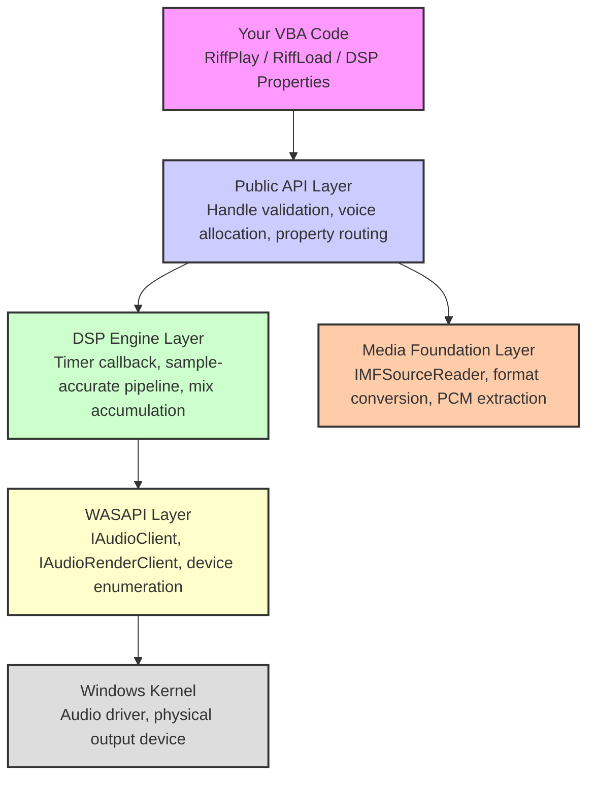
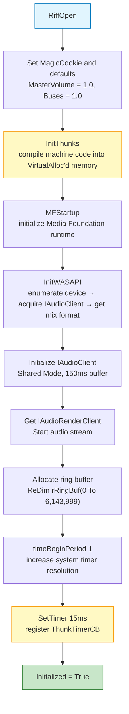
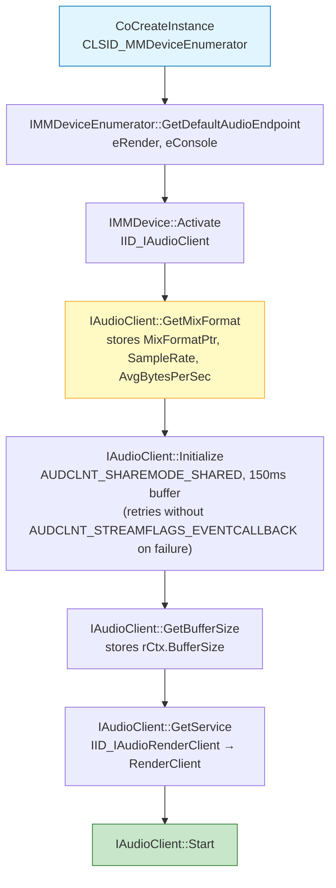
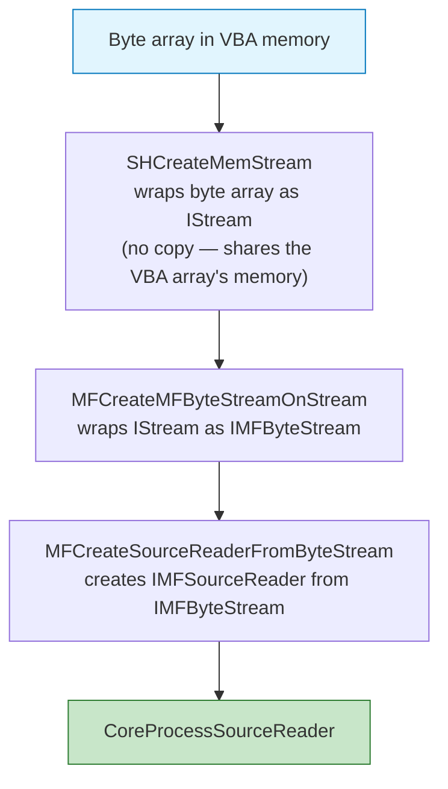
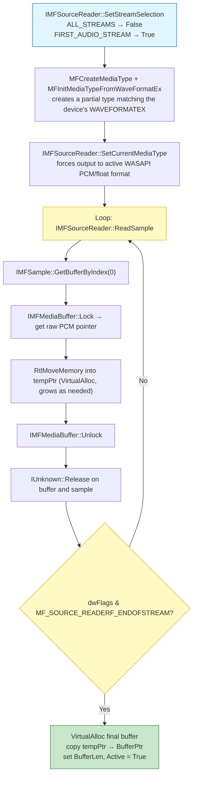
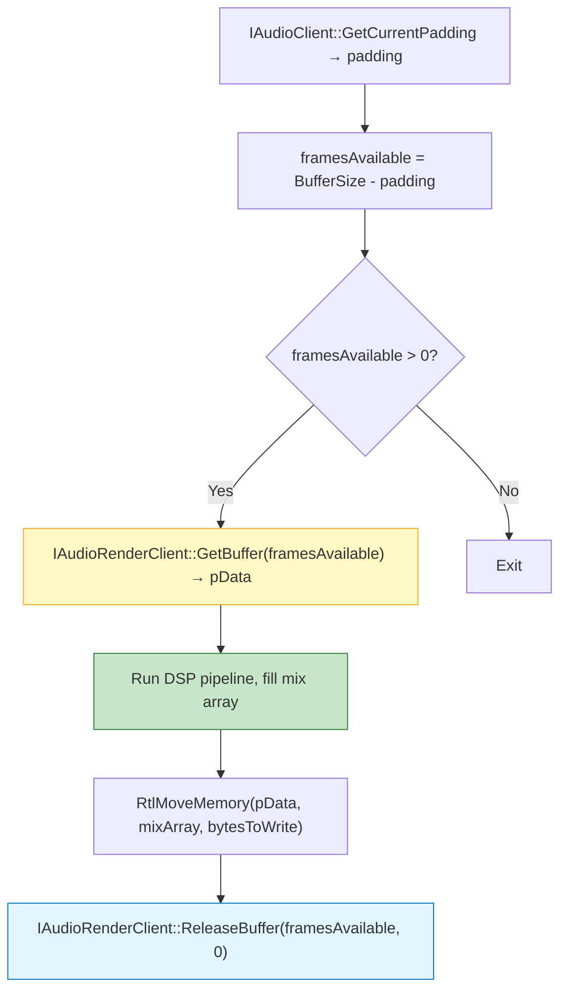
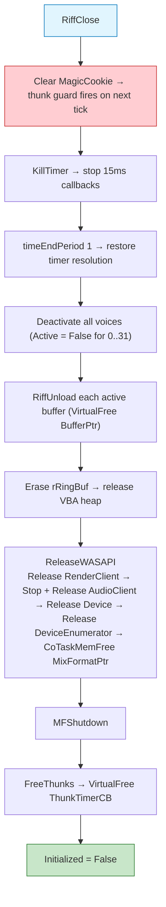

# Riff Architecture

This document describes the internal architecture of Riff. It is intended for contributors, advanced users, and anyone who wants to understand how the engine works under the hood.

## Table of Contents

- [High-Level Overview](#high-level-overview)
- [Global State](#global-state)
  - [RiffContext](#riffcontext)
  - [RiffBuffer Pool](#riffbuffer-pool)
  - [RiffVoice Pool](#riffvoice-pool)
  - [Ring Buffer](#ring-buffer)
- [Initialization Sequence](#initialization-sequence)
  - [Thunk Compilation](#thunk-compilation)
  - [WASAPI Initialization](#wasapi-initialization)
  - [Media Foundation Startup](#media-foundation-startup)
- [Audio Decoding Pipeline](#audio-decoding-pipeline)
  - [File-Based Loading](#file-based-loading)
  - [Memory-Based Loading](#memory-based-loading)
  - [CoreProcessSourceReader](#coreprocesssourcereader)
- [DSP Timer Callback](#dsp-timer-callback)
  - [WASAPI Buffer Acquisition](#wasapi-buffer-acquisition)
  - [Voice Iteration](#voice-iteration)
  - [Source Reading and Pitch Shifting](#source-reading-and-pitch-shifting)
  - [Oscillator Generation](#oscillator-generation)
- [DSP Pipeline](#dsp-pipeline)
  - [Stage Order](#stage-order)
  - [Bitcrusher](#bitcrusher)
  - [Distortion](#distortion)
  - [Low-Pass and High-Pass Filters](#low-pass-and-high-pass-filters)
  - [3-Band EQ](#3-band-eq)
  - [Ring Modulator](#ring-modulator)
  - [Tremolo](#tremolo)
  - [Stereo Width](#stereo-width)
  - [Ring Buffer Effects: Flanger, Chorus, Delay, Reverb](#ring-buffer-effects-flanger-chorus-delay-reverb)
  - [Compressor](#compressor)
  - [Auto-Pan and Final Gain](#auto-pan-and-final-gain)
  - [Fade Envelope](#fade-envelope)
  - [Mix Accumulation](#mix-accumulation)
- [Output Paths](#output-paths)
  - [32-Bit Float Path (Modern Hardware)](#32-bit-float-path-modern-hardware)
  - [16-Bit Integer Path (Legacy Hardware)](#16-bit-integer-path-modern-hardware)
- [Peak Metering](#peak-metering)
- [Audio Buses](#audio-buses)
- [Loop and Seek](#loop-and-seek)
- [Fade System](#fade-system)
- [COM VTable Dispatch](#com-vtable-dispatch)
- [Platform Compatibility](#platform-compatibility)
- [Memory Layout](#memory-layout)
- [Shutdown Sequence](#shutdown-sequence)

## High-Level Overview

Riff is a single-file VBA module (`Riff.bas`) that implements a complete real-time audio engine using only native Windows APIs and COM interfaces. It carries no external dependencies beyond what ships with every modern Windows installation.

The engine is organized into four distinct layers:



Riff is dual-architecture compatible. All Win32 API declarations are guarded by `#If VBA7 Then ... #Else ... #End If` blocks and pointer-sized fields use `LongPtr` on 64-bit hosts and `Long` on 32-bit hosts, allowing the same source file to run on both Office x86 and Office x64 without modification.

## Global State

Riff stores its entire state in three module-level structures and one dynamic array. There are no class instances, no COM object references in VBA objects, and no heap allocations via VBA. All memory management goes through `VirtualAlloc` and `VirtualFree` directly.

### RiffContext

`RiffContext` is a single `Private` UDT instance (`rCtx`) that holds the engine-level state:

| Category | Fields |
|:---|:---|
| Guard | `MagicCookie`, `Initialized` |
| Master | `MasterVolume`, `MasterPeakL`, `MasterPeakR` |
| Device format | `SampleRate`, `AvgBytesPerSec`, `MixFormatPtr` |
| WASAPI pointers | `DeviceEnumerator`, `Device`, `AudioClient`, `RenderClient`, `BufferSize` |
| Timer | `ThunkTimerCB`, `TimerID` |
| Buses | `Buses(0 To 15)` |
| Buffer pool | `Buffers(0 To 63)` as `RiffBuffer` |

The `MagicCookie` field is set to `&H52494646` ("RIFF" in ASCII) at initialization and cleared to `0` on shutdown. The timer callback checks this value as its very first operation and exits immediately if it does not match, making the callback safe against stale timer firings after `RiffClose`.

### Auto-Suspend Logic
To minimize CPU impact during silence, Riff includes an optional `AutoSuspendTimer` feature. When enabled, the engine monitors active voice counts. If no voices are processed for a pre-defined interval, the `SetTimer` callback is killed. The engine "wakes up" automatically via `RiffEnsureRenderTimer` whenever a new `RiffPlay` or `RiffPlayOscillator` call is issued.

### RiffBuffer Pool

`RiffBuffer` is a 64-entry array embedded within `RiffContext`. Each entry holds:

| Field | Type | Purpose |
|:---|:---|:---|
| `Active` | `Boolean` | Whether this slot contains valid PCM data |
| `BufferPtr` | `LongPtr` / `Long` | Pointer to the `VirtualAlloc`-ed PCM block |
| `BufferLen` | `Long` | Size of the PCM block in bytes |

Buffer slots are allocated linearly on first-fit. `RiffLoad` and `RiffLoadFromMemory` scan from index `0` to `63` and take the first `Active = False` slot. `RiffUnload` sets `Active = False` and calls `VirtualFree` on `BufferPtr`.

### RiffVoice Pool

`rVoices` is a 32-entry array of `RiffVoice` UDTs declared at module level. Each voice contains the complete DSP state for one polyphonic channel:

| Category | Fields |
|:---|:---|
| Identification | `Active`, `Playing`, `Paused`, `busID`, `BufferIndex` |
| Oscillator | `IsOscillator`, `OscType`, `OscFreq`, `OscPhase` |
| Metering | `PeakL`, `PeakR` |
| Playback control | `Position`, `Volume`, `Pitch`, `Pan` |
| Fade | `fadeState`, `FadeFramesTotal`, `FadeFramesCurrent` |
| Loop | `Looping`, `loopStart`, `loopEnd` |
| Ring buffer | `RingWritePos` |
| Bitcrusher | `BitcrushSteps`, `BitcrushDownsample`, `BitcrushDsCount`, `BitcrushLastL`, `BitcrushLastR` |
| Distortion | `Distortion` |
| Filters | `LowPass`, `HighPass`, `FilterStateL`, `FilterStateR`, `FilterStateHP_L`, `FilterStateHP_R` |
| EQ | `EqBass`, `EqMid`, `EqTreble`, `EqStateLowL`, `EqStateLowR`, `EqStateHighL`, `EqStateHighR` |
| Compressor | `CompThreshold`, `CompRatio`, `CompEnv` |
| Ring Modulator | `RingModFreq`, `RingModMix`, `RingModPhase` |
| Tremolo | `TremoloRate`, `TremoloDepth`, `TremoloPhase` |
| Auto-Pan | `AutoPanRate`, `AutoPanDepth`, `AutoPanPhase` |
| Chorus | `ChorusRate`, `ChorusDepth`, `ChorusPhase` |
| Flanger | `FlangerRate`, `FlangerDepth`, `FlangerFeedback`, `FlangerPhase` |
| Reverb | `ReverbMix`, `ReverbTime`, `RevTap1`, `RevTap2`, `RevTap3`, `RevTap4` |
| Delay | `DelayTime`, `DelayFeedback`, `DelayMix` |
| Stereo Width | `StereoWidth` |

Voice allocation is performed by `InternalGetFreeVoice`, which scans from index `0` to `31` and returns the first slot where `Active = False`. Allocation is O(n) in the worst case but O(1) amortized in typical usage patterns.

### Ring Buffer

`rRingBuf` is a module-level `Single` array declared as:

```vb
Private rRingBuf() As Single
ReDim rRingBuf(0 To (32 * 192000) - 1)
```

This is a **contiguous 1D array** of 6,144,000 `Single` samples representing 32 per-voice blocks of 192,000 samples each. Voice `i` maps to the slice `rRingBuf(i * 192000)` through `rRingBuf((i + 1) * 192000 - 1)`.

The 1D layout is deliberate. A 2D VBA array `rRingBuf(31, 191999)` would be stored in column-major order, making `RtlZeroMemory` on a single row incorrect. With a 1D layout, zeroing voice `i`'s block is a single correct `RtlZeroMemory` call:

```vb
RtlZeroMemory VarPtr(rRingBuf(slot * 192000)), 192000 * 4
```

At 48 kHz stereo, 192,000 samples represents approximately 2 seconds of interleaved stereo audio per voice. The ring buffer is shared by Delay, Chorus, Flanger, and Reverb for the same voice; all four effects read from different offsets behind the write pointer.

## Initialization Sequence

`RiffOpen` executes the following sequence. If any step fails, all previously acquired resources are released before returning `False`.



### Thunk Compilation

`InitThunks` allocates a block of executable memory via `VirtualAlloc` with `PAGE_EXECUTE_READWRITE` and writes a sequence of machine-code opcodes into it. This native thunk serves as the bridge between the Win32 timer callback ABI (which passes four parameters on the stack) and the VBA subroutine `RiffTimerCallback`.

The thunk performs two checks before dispatching to VBA:

1. It calls `EbMode` from `vbe7.dll` (or `vba6.dll` on 32-bit hosts). `EbMode` returns `1` if VBA is in a break or design state. If so, the thunk calls `KillTimer` to remove itself and returns without invoking the VBA callback, preventing a crash on project reset.
2. If VBA is running normally (`EbMode` returns `0`), the thunk calls `RiffTimerCallback` with the original four timer parameters.

The thunk is architecture-specific. Two separate opcode sequences are compiled conditionally:

| Condition | Opcode sequence |
|:---|:---|
| `#If Win64` | 64-bit System V–style ABI with `sub rsp, 28h` stack alignment |
| `#Else` | 32-bit `stdcall` with `push` arguments and `ret 16` epilogue |

After writing the opcodes, the addresses of `EbMode`, `KillTimer`, and `RiffTimerCallback` are patched directly into the machine code at their pre-calculated offsets.

### WASAPI Initialization

`InitWASAPI` acquires the Windows audio output device through COM interfaces without using `CoCreateInstance` from VBA's runtime — instead it uses the raw `CoCreateInstance` API from `ole32.dll` directly. All COM method calls go through `vCall`, the internal VTable dispatcher described in [COM VTable Dispatch](#com-vtable-dispatch).

The initialization sequence inside `InitWASAPI`:



The device's native mix format is read from `MixFormatPtr`, then Riff attempts to promote it to stereo 32-bit float and checks the candidate with `IAudioClient::IsFormatSupported`. If Windows rejects that format, Riff restores the original mix format and only proceeds if the fallback is stereo PCM16 or PCM32. The active `MixFormatPtr` remains valid for the entire session and is freed by `CoTaskMemFree` in `ReleaseWASAPI`. The fields read at runtime are `nChannels` (offset +2), `nSamplesPerSec` (offset +4), `nAvgBytesPerSec` (offset +8), `nBlockAlign` (offset +12), and `wBitsPerSample` (offset +14).

### Media Foundation Startup

`MFStartup(MF_VERSION, 0)` initializes the Media Foundation platform. This call is required before any `IMFSourceReader` can be created. The constant `MF_VERSION = &H20070` corresponds to Media Foundation version 2.0 (Windows 7 and later). `MFShutdown` is called symmetrically in `RiffClose`.

## Audio Decoding Pipeline

Both `RiffLoad` and `RiffLoadFromMemory` converge on the same internal function `CoreProcessSourceReader`, which performs all the heavy work of extracting PCM data.

### File-Based Loading

`RiffLoad` calls `MFCreateSourceReaderFromURL` with the file path as a `LongPtr` to a wide-character string (`StrPtr`). Before creating the reader, it attempts to create an `MFAttributes` store and set the `MF_SOURCE_READER_ENABLE_AUDIO_PROCESSING` attribute (GUID `{7632CB14-D379-4770-AE7D-EA24154D9298}`) to `1`. This attribute enables Media Foundation's built-in audio resampling pipeline, ensuring that the decoded audio is automatically converted to Riff's active WASAPI sample rate and format without manual resampling in VBA.

### Memory-Based Loading

`RiffLoadFromMemory` follows a longer chain:



> [!NOTE]
> `SHCreateMemStream` does not copy the byte array — it returns an `IStream` backed directly by the VBA array's memory. The array must remain alive until `CoreProcessSourceReader` completes. Since VBA passes arrays `ByRef` and `CoreProcessSourceReader` runs synchronously, this is always safe.

Both `pByteStream` and `pStream` are released via `IUnknown::Release` (VTable index 2 via `vCall`) after the reader is created, since the reader holds its own reference.

### CoreProcessSourceReader

`CoreProcessSourceReader` configures the `IMFSourceReader` to output audio in Riff's active WASAPI mix format, then reads all decoded samples into a temporary `VirtualAlloc`-ed buffer, growing it as needed.



The temporary buffer starts at 50 MB (`1048576 * 50` bytes) and is reallocated by doubling whenever remaining capacity would be exceeded. After the read loop, a final tight-fitting `VirtualAlloc` is made and the data is copied in, after which the temporary buffer is freed. This ensures the final physical memory footprint matches the actual decoded audio size with no wasted pages.

All `IMFSourceReader`, `IMFSample`, and `IMFMediaBuffer` COM method calls are made via `DispCallFunc` directly rather than through the `vCall` helper. This is because the ReadSample call requires six parameters including `ByRef`-typed output pointers for `dwFlags`, `llTimestamp`, and `ppSample`, which must be laid out precisely to match the COM ABI. Pre-built argument type arrays (`rTypes`, `rPtrs`) are constructed before the loop and reused on every iteration to avoid per-iteration allocation overhead.

## DSP Timer Callback

`RiffTimerCallback` is the engine's heartbeat. It is called by the native thunk every 10 ms. Its job is to query how many audio frames WASAPI needs, synthesize that many frames by running the DSP pipeline across all active voices, and deliver the result to the hardware.

### WASAPI Buffer Acquisition



`GetCurrentPadding` returns the number of frames already queued in the hardware buffer that have not yet been played. Subtracting from `BufferSize` gives the number of frames Riff must write this tick. This pull-based model is standard WASAPI shared-mode operation.

### Voice Iteration

The callback iterates over all 32 voice slots. For each slot where `Active = True`, `Playing = True`, and `Paused = False`, it extracts all DSP parameters from the voice struct into local variables before the inner sample loop begins. This is a deliberate optimization: accessing module-level UDT fields inside a tight `For` loop in VBA is slower than reading local `Single` variables, because each UDT field access goes through an additional indirection.

### Source Reading and Pitch Shifting

For buffer-backed voices, the callback reads ahead from the source buffer based on the current pitch multiplier:

```
framesNeeded = Int(framesAvailable × pitch) + 2
bytesNeeded  = framesNeeded × blockAlign
```

The `+ 2` guard leaves room for interpolation against the next stereo frame. The needed slice is copied from physical memory into reusable scratch arrays (`rSrcArr32`, `rSrcArrI32`, or `rSrcArr16`) via `RtlMoveMemory` before the per-frame loop. These arrays grow only when the current callback needs more capacity, then the active region is cleared and reused on later callbacks.

Within the per-frame loop, playback advances by `srcIdx + pitch` on each frame and the buffer position advances by `ptchAlign = pitch × blockAlign`. The source sample index is computed as `Int(srcIdx) × 2` (for stereo interleaved pairs), while the fractional component is used for linear interpolation between adjacent frames. This keeps pitched playback continuous across timer callbacks.

Loop boundaries are checked at the start of each frame:

```
If pos >= loopEnd Then
    If Looping Then
        pos = loopStart
    Else
        rVoices(i).Active = False
        Exit For
    End If
End If
```

### Oscillator Generation

For oscillator voices (`IsOscillator = True`), no buffer reading occurs. Instead, each frame computes a sample mathematically:

| `OscType` | Waveform | Formula |
|:---|:---|:---|
| 0 | Sine | `Sin(OscPhase)` |
| 1 | Square | `IIf(Phase < 0.5, 1.0, -1.0) + BLEP` |
| 2 | Sawtooth | `(2.0 × Phase) - 1.0 - BLEP` |
| 3 | White Noise | `(Rnd() × 2.0) - 1.0` |
| 4 | Pink Noise | `Filtered White (Voss-McCartney)` |
| 5 | Brown Noise | `Accumulated White (Integrator)` |

The phase advances by `oscStep = (PI2 × OscFreq) / SampleRate` per frame and wraps modulo `PI2`. The same value is written to both `fL` and `fR` before pan and width processing, producing a mono-center oscillator that can be spread with `RiffVoiceStereoWidth`.

## DSP Pipeline

### Stage Order

Every active voice processes each frame through the following fixed-order pipeline. Stages with zero-valued mix or depth parameters are not fully skipped by conditional logic — each stage has its own `If` guard in the inner loop, so inactive stages cost one branch check per frame.

```mermaid
graph TD
    A["Source Sample (fL, fR)"]
    B["Sample Rate Reduction<br/>(Bitcrusher downsampler)"]
    C["Bit Depth Reduction<br/>(Bitcrusher quantizer)"]
    D["Distortion<br/>(multiply + hard clip)"]
    E["Low-Pass Filter<br/>(biquad IIR)"]
    F["High-Pass Filter<br/>(biquad IIR)"]
    G["3-Band EQ<br/>(three cascaded biquads → bass/mid/treble)"]
    H["Ring Modulator<br/>(sine oscillator × signal)"]
    I["Tremolo<br/>(volume LFO)"]
    J["Stereo Width<br/>(mid/side processing)"]
    K["Flanger<br/>(short LFO-swept comb filter via ring buffer)"]
    L["Chorus<br/>(modulated delay tap via ring buffer)"]
    M["Delay / Echo<br/>(fixed delay tap with feedback via ring buffer)"]
    N["Reverb<br/>(four-tap comb filter via ring buffer)"]
    O["Ring Buffer Write<br/>(bufInL, bufInR → rRingBuf at dWrite)"]
    P["Compressor<br/>(envelope follower + gain reduction)"]
    Q["Auto-Pan<br/>(LFO-modulated pan)"]
    R["Volume × Bus × Master × Fade"]
    S["Mix Accumulation<br/>(add to mixArr)"]

    A-->B-->C-->D-->E-->F-->G-->H-->I-->J-->K-->L-->M-->N-->O-->P-->Q-->R-->S

    style A fill:#e1f5fe,stroke:#0277bd
    style O fill:#f3e5f5,stroke:#7b1fa2
    style S fill:#c8e6c9,stroke:#2e7d32
```



### Bitcrusher

The bitcrusher runs in two independent sub-stages. Sample rate reduction comes first, implemented as a sample-hold:

```
If dsCount >= dsFactor Then
    dsCount = 0
    lastL = fL : lastR = fR   ' capture new sample
Else
    fL = lastL : fR = lastR   ' hold previous sample
    dsCount = dsCount + 1
End If
```

Bit depth reduction follows, implemented as uniform scalar quantization:

```
fL = Int(fL × bdSteps) / bdSteps
fR = Int(fR × bdSteps) / bdSteps
```

Where `bdSteps = 2 ^ bitDepth`. When `bdSteps = 0` (disabled), this stage is skipped.

### Distortion

Hard-clip distortion multiplies the signal by the distortion factor and then clamps:

```
fL = fL × dist
If fL > 1.0 Then fL = 1.0
If fL < -1.0 Then fL = -1.0
```

At `dist = 1.0` the signal is unchanged. At high values (e.g. `10.0`), nearly the entire waveform is clipped, producing a square-wave-like fuzz.

### Low-Pass and High-Pass Filters

Both filters are implemented as Direct Form 1 biquad filters. A biquad filter uses two previous input samples and two previous output samples (the Z1 and Z2 state variables) to create a steep, resonant, or smooth cutoff depending on its Q factor.

```
fL = (fL × b0) + (Z1L × b1) + (Z2L × b2) - (Z1OutL × a1) - (Z2OutL × a2)
```

The filter state variables (`BqLowPassZ1L`, `BqLowPassZ2L`, etc.) are stored in the voice struct and persist across timer callback invocations. The coefficients (`a1`, `a2`, `b0`, `b1`, `b2`) are calculated per callback based on the normalized cutoff property and the engine's sample rate.

### 3-Band EQ

The EQ is implemented as three cascaded parametric biquad filters (a low shelf, a mid peaking filter, and a high shelf). Each band has its own independent per-voice state variables:

```
' Bass shelf at ~120 Hz
fL = RiffBiquadProcess(fL, EqBassZ1L, EqBassZ2L, ...)

' Mid peaking filter at ~1000 Hz
fL = RiffBiquadProcess(fL, EqMidZ1L, EqMidZ2L, ...)

' Treble shelf at ~6500 Hz
fL = RiffBiquadProcess(fL, EqTrebleZ1L, EqTrebleZ2L, ...)
```

The EQ computation is guarded by a check that all three gain values equal exactly `1.0`, in which case the entire block is skipped:

```
If eqB <> 1.0 Or eqM <> 1.0 Or eqT <> 1.0 Then
    ' ... Biquad cascaded EQ computation ...
End If
```

### Ring Modulator

The ring modulator multiplies the audio signal by a sine oscillator with frequency `RingModFreq`. A wet/dry blend is applied:

```
rmOsc = Sin(rmPhase)
fL = fL × (1 - rmMix) + (fL × rmOsc) × rmMix
```

The phase advances by `rmStep = (PI2 × rmFreq) / SampleRate` per frame and wraps modulo `PI2`.

### Tremolo

Tremolo modulates the output amplitude with a sine LFO. The LFO output is mapped to a range that avoids hard silence unless `TremoloDepth = 1.0`:

```
trmMult = 1 - TremoloDepth × (0.5 + 0.5 × Sin(trmPhase))
fL = fL × trmMult
```

At `TremoloDepth = 0`, `trmMult = 1.0` (no modulation). At `TremoloDepth = 1.0`, `trmMult` oscillates between `0.0` and `1.0`.

### Stereo Width

Mid/side processing separates the signal into a center (mid) and difference (side) component, then scales the side component:

```
mid  = (fL + fR) × 0.5
side = (fL - fR) × 0.5
fL   = mid + side × StereoWidth
fR   = mid - side × StereoWidth
```

At `StereoWidth = 1.0` the signal is unchanged. At `0.0` both channels become identical (mono). Values above `1.0` exaggerate the stereo field. This stage is guarded by `If sWidth <> 1.0`.

### Ring Buffer Effects: Flanger, Chorus, Delay, Reverb

All four time-based effects share the same ring buffer region for voice `i` (`rRingBuf(i × 192000)`) and the same write pointer `dWrite`. The write pointer advances by 2 each frame (one stereo pair) and wraps at 192,000.

**Flanger** reads a tap at an LFO-swept short delay (2–7 ms) and mixes it back:

```
fDel = Int((0.002 + 0.005 × Sin(flgPhase)) × SampleRate) aligned to even
fRd  = (dWrite - fDel + 192000) Mod 192000
fL   = fL + rRingBuf(dBase + fRd) × flgDepth
```

The feedback path (`flgFB`) is added to `bufInL` before the ring buffer write.

**Chorus** reads a longer, slower-swept tap (20–25 ms) and blends it at a reduced dry level:

```
cDelay = Int((0.02 + 0.005 × Sin(cPhase)) × SampleRate) aligned to even
fL     = fL × (1 - cDepth × 0.5) + rRingBuf(dBase + cRead) × cDepth
```

**Delay** reads a fixed tap at `dSamples = Int(DelayTime × SampleRate)` frames behind the write pointer. The feedback coefficient is added to `bufInL` before the ring buffer write:

```
dRead    = (dWrite - dSamples + 192000) Mod 192000
fL       = fL + rRingBuf(dBase + dRead) × dMix
bufInL   = bufInL + rRingBuf(dBase + dRead) × dFB
```

**Reverb** uses a four-tap comb filter. The tap delays are computed once at voice reset from the sample rate:

```
RevTap1 = Int(0.029 × SampleRate) aligned to even   ' ~29 ms
RevTap2 = Int(0.043 × SampleRate) aligned to even   ' ~43 ms
RevTap3 = Int(0.073 × SampleRate) aligned to even   ' ~73 ms
RevTap4 = Int(0.097 × SampleRate) aligned to even   ' ~97 ms
```

The reverb output is the average of all four taps, and the feedback coefficient (`ReverbTime`) is added to `bufInL` before the ring buffer write:

```
revL   = (tap1L + tap2L + tap3L + tap4L) × 0.25
fL     = fL + revL × rMix
bufInL = bufInL + revL × rTime
```

Because all four effects write their feedback contributions to `bufInL` before the ring buffer write, the ring buffer at any given read position contains the mixed accumulation of the dry signal, delay feedback, flanger feedback, and reverb feedback from previous frames. The chorus does not contribute feedback.

### Compressor

The compressor is an envelope follower-based gain processor. The envelope tracker has asymmetric time constants: fast attack (`0.01`) and slow release (`0.001`):

```
If peak > cmpEnv Then
    cmpEnv = cmpEnv + 0.01  × (peak - cmpEnv)   ' attack
Else
    cmpEnv = cmpEnv + 0.001 × (peak - cmpEnv)   ' release
End If
```

Gain reduction is applied only when `cmpEnv > cmpThresh`:

```
If cmpEnv > cmpThresh Then
    cmpGain = (cmpThresh + (cmpEnv - cmpThresh) / cmpRatio) / cmpEnv
    fL = fL × cmpGain
    fR = fR × cmpGain
End If
```

`CompEnv` persists in the voice struct across callback invocations, giving the envelope follower its memory. Setting `CompRatio = 1.0` disables the computation because the `If cmpRatio > 1.0` guard skips the entire block.

### Auto-Pan and Final Gain

Auto-Pan computes a time-varying pan offset added to the voice's static `Pan` property:

```
curPan = Pan + Sin(apPhase) × apDepth
curPan = Clamp(curPan, -1.0, 1.0)
```

The final per-channel gain is computed as:

```
vL = Volume × MasterVolume × BusVolume
vR = Volume × MasterVolume × BusVolume

If curPan > 0 Then vL = vL × (1 - curPan)   ' attenuate left
If curPan < 0 Then vR = vR × (1 + curPan)   ' attenuate right
```

This is a linear panning law. No constant-power (equal-power) correction is applied.

### Fade Envelope

The fade system uses a `fadeState` integer per voice: `0` = no fade, `1` = fade-in, `2` = fade-out. The multiplier is computed per frame:

```
' Fade-in
fadeMult = FadeFramesCurrent / FadeFramesTotal

' Fade-out
fadeMult = 1 - (FadeFramesCurrent / FadeFramesTotal)
```

When a fade-out completes (`fadeCur >= fadeTot`), the voice is marked `Active = False` and `Playing = False` immediately at the frame boundary, causing the inner loop to exit and no further samples to be written for that voice.

### Mix Accumulation

After all gain stages, the final `fL` and `fR` values are accumulated into the shared mix array:

```
mixArr32(writeIdx)     = mixArr32(writeIdx)     + fL
mixArr32(writeIdx + 1) = mixArr32(writeIdx + 1) + fR
```

For the 32-bit float path, accumulation happens in `Single` scratch buffers and is clamped to `[-1.0, 1.0]` before handing frames to WASAPI. For 32-bit PCM fallback, the same normalized mix is converted to signed 32-bit integers. For the 16-bit integer path, per-sample clamping to `[-32768, 32767]` is required during accumulation.

## Output Paths

After all voices are processed, the mix array is delivered to WASAPI via `RtlMoveMemory` from the VBA array's memory directly to the pointer returned by `GetBuffer`. No intermediate copy is made.

### 32-Bit Float Path (Modern Hardware)

For devices reporting `wBitsPerSample = 32`, Riff uses reusable scratch arrays:

```vb
RiffEnsureSingleScratch rMixArr32, rMixArr32Cap, sampleCount32
RiffClearSingleScratch rMixArr32, sampleCount32
```

All DSP arithmetic runs in single-precision floating point natively. At the end of the callback, the active region of the mix buffer is copied to WASAPI as float32 or converted to PCM32 when the fallback mix format requires it.

### 16-Bit Integer Path (Legacy Hardware)

For devices reporting `wBitsPerSample = 16`, Riff reuses an `Integer` scratch array and accumulates each voice's contribution after scaling and clamping:

```vb
l1 = CLng(rMixArr16(writeIdx)) + CLng(fL × 32767.0)
If l1 > 32767  Then l1 = 32767
If l1 < -32768 Then l1 = -32768
rMixArr16(writeIdx) = CInt(l1)
```

The scale factor `32767.0` maps the normalized `[-1.0, 1.0]` float range to the signed 16-bit integer range. Accumulation uses `Long` intermediates to avoid integer overflow during addition of multiple voices.

## Peak Metering

Peak values are tracked at two levels. Per-voice peaks (`PeakL`, `PeakR`) are updated inside the inner frame loop after final gain application. Master peaks (`MasterPeakL`, `MasterPeakR`) are updated during mix accumulation.

Both levels use the same decay pattern. At the start of each timer callback, existing peak values are multiplied by `0.9`:

```vb
rCtx.MasterPeakL = rCtx.MasterPeakL × 0.9
rVoices(i).PeakL = rVoices(i).PeakL × 0.9
```

During frame processing, if the current frame's absolute amplitude exceeds the decayed peak, the peak is updated. This gives a fast-attack, gradual-release meter behavior. At 10 ms callback intervals, the master peak reaches half its value after approximately `log(0.5) / log(0.9) ≈ 6.6` callbacks, or ~66 ms.

## Audio Buses

Audio buses provide a mechanism for global gain control and logical signal routing. Riff implements 16 independent buses (`rCtx.Buses(0 To 15)`), each serving as a destination for one or more playback voices.

### Signal Flow Arithmetic
The engine uses a non-destructive, multiplicative gain stage. The final amplitude of a sample processed through the mixer is calculated as:

`Final Sample = Input × Voice Volume × Bus Volume × Master Volume`

This hierarchy allows for granular control at the source (Voice), group control at the mixer (Bus), and hardware-level control (Master) without altering the state of unrelated audio paths.

### Mixing and Routing
The sixteen buses are simple `Single` scalars initialized to `1.0` (unity gain). There is no bus-level DSP processing or cross-bus routing; buses are optimized purely for fast gain multiplication within the inner render loop.

Each voice's `busID` field is evaluated on every timer callback. Modifying a bus volume via `RiffBusVolume(busID) = value` or `RiffBusFadeTo` updates the corresponding scalar in `rCtx.Buses`, taking effect on the very next render tick with no additional latency.

## Loop and Seek

Loop boundaries (`loopStart`, `loopEnd`) are stored as byte offsets into the PCM buffer rather than as sample indices or seconds. This is because the inner loop position variable `pos` is also a byte offset, making boundary comparisons a direct numeric comparison with no conversion.

`RiffSetLoopRegionSec` converts seconds to byte offsets using `AvgBytesPerSec`, then aligns the result to `nBlockAlign` (the size of one stereo sample pair in bytes) to prevent the position from drifting to a mid-frame byte offset:

```vb
sByte = Int(startSec × AvgBytesPerSec)
sByte = (CLng(sByte) \ align) × align
```

Similarly, `RiffVoicePositionSec` on the write path converts seconds to bytes and aligns to block boundaries. On the read path it divides the current byte position by `AvgBytesPerSec`. Both paths assume constant bitrate, which is always the case for raw PCM buffers stored after Media Foundation decoding.

## Fade System

`RiffFadeIn` and `RiffFadeOut` convert a duration in seconds to a frame count by multiplying by `SampleRate`:

```vb
FadeFramesTotal = CLng(durationSec × rCtx.SampleRate)
FadeFramesCurrent = 0
fadeState = 1  ' or 2
```

The fade is computed per frame inside the inner DSP loop, not per callback. This gives sample-accurate fades regardless of the WASAPI buffer size or the 10 ms timer period. For example, a 3-second fade at 48 kHz results in 144,000 frame-level multiplier steps, each incrementing by `1 / 144,000 ≈ 6.94e-6` per frame.

## COM VTable Dispatch

All COM method calls in Riff go through `vCall`, a private variadic function that wraps `DispCallFunc` from `oleaut32.dll`:

```vb
Private Function vCall(ByVal pUnk As LongPtr, ByVal vTableIndex As Long, _
                       ParamArray args() As Variant) As Long
```

`DispCallFunc` is a documented OLE Automation API that invokes a function at a given offset from a pointer, using a given calling convention and argument type list. Riff uses it with `CC_STDCALL = 4` and `vtReturn = vbLong` for all COM interface methods, which matches the `HRESULT STDMETHODCALLTYPE` signature of every WASAPI and Media Foundation method.

The VTable offset is computed as:

```
offset = vTableIndex × pointerSize
```

Where `pointerSize` is 8 on Win64 and 4 on Win32. VTable index 2 is always `IUnknown::Release`, index 3 is the first interface-specific method (since index 0 is `QueryInterface` and index 1 is `AddRef`).

`CoreProcessSourceReader` bypasses `vCall` for the hot ReadSample loop and calls `DispCallFunc` directly with pre-built argument arrays to avoid variadic `ParamArray` overhead on every sample read iteration.

## Platform Compatibility

| Feature | 32-bit VBA (Office x86) | 64-bit VBA (Office x64) |
|:---|:---|:---|
| Pointer type | `Long` | `LongPtr` |
| VTable offset stride | 4 bytes | 8 bytes |
| Thunk opcodes | 32-bit `stdcall` push/ret sequence | 64-bit ABI with RSP alignment |
| `LongLong` for WASAPI durations | Simulated via `Currency` | Native `LongLong` |
| 64-bit REFERENCE_TIME | `Currency` (`CCur(100)` → 100 × 10,000 = 1,000,000 in 100 ns units) | `CLngLng(1000000)` (100 ns units) |

The `REFERENCE_TIME` values passed to `IAudioClient::Initialize` differ by architecture. On Win64, the 100 ms buffer duration is `1,000,000` in 100-nanosecond units. On Win32, `Currency` is used as a surrogate for 64-bit integers: the value `CCur(100)` represents `1,000,000` because `Currency` has an implicit 10,000× scaling factor.

## Memory Layout

```
Module-level allocations:

  rCtx:           1 × RiffContext UDT (~512 bytes, stack-allocated in module)
  rVoices:        32 × RiffVoice UDT (~3 KB each, ~96 KB total)
  rRingBuf:       32 × 192,000 × 4 bytes = 24,576,000 bytes (~23.4 MB, heap via VBA ReDim)

  Per loaded buffer (VirtualAlloc, physical pages):
    BufferPtr:    variable (raw PCM size, e.g. ~10 MB for a 1 min 44.1kHz stereo WAV)

  Thunk:          1 KB VirtualAlloc'd executable page

  Total fixed overhead: ~23.5 MB + loaded audio data
```

> [!NOTE]
> The 23.4 MB ring buffer is the dominant fixed allocation. It is present regardless of how many voices or buffers are active. If memory pressure is a concern, the ring buffer size per voice can be reduced by changing the `192000` constant, which trades maximum delay/reverb time for lower memory usage.

## Shutdown Sequence

`RiffClose` executes the inverse of `RiffOpen` in safe order:



Clearing `MagicCookie` before calling `KillTimer` is intentional. There is a narrow race window between the last timer callback check and `KillTimer` completing on the Windows side. If a stale callback fires in that window, it will read `MagicCookie = 0`, fail the guard check at the first line of `RiffTimerCallback`, and exit immediately without touching any partially-released state.
